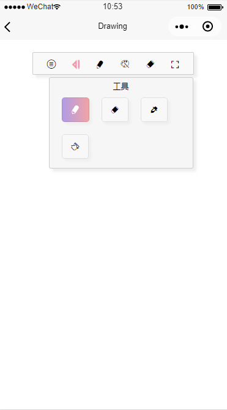
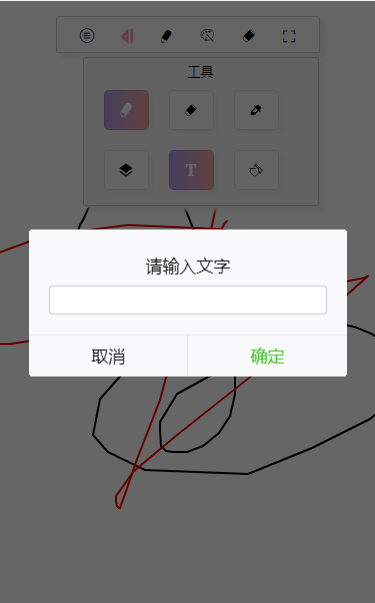
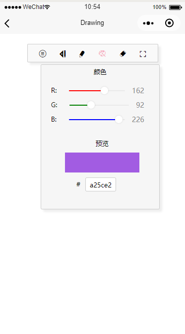
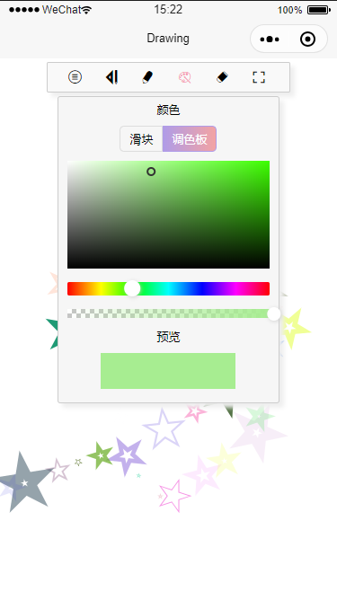
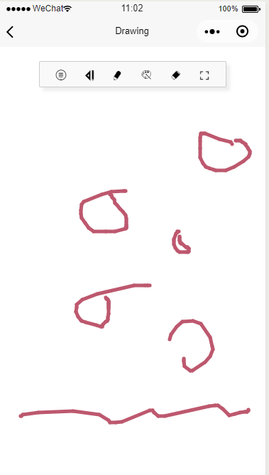

# Drawing-board
## 微信小程序实现的画板（手绘板）
### 更新
- 更新基础库，使用canvs 2d
- 修复图片导入大小问题
- 修复多次重绘canvas问题
- 新增仿PS调色板
- 新增画圆形，新增画填充的图形（矩形，圆形）
- 新增橡皮透明度
- 新增笔刷，可画出特别的图形

>PS: canvas 2d暂时不支持真机调试

### 参考
拖拽参考[https://github.com/wxa-component/wxa-comp-canvas-drag](https://github.com/wxa-component/wxa-comp-canvas-drag)

调色板参考[如何实现一个颜色选择器](https://juejin.im/post/6844903908339351560)

笔刷参考[canvas笔触魔法师](https://juejin.im/post/6844903740785295373)

-----------------------------------------------------------------------------------------------------------------------

> 令人头秃= = 被微信小程序的canvas层级问题折磨了一整个上午orz

> 解决方案：参考网上的方法保存一个状态控制canvas的位置和假canvasx图片的显示和隐藏，不断通过canvas生成图片，然后重绘图片到canvas上

## 基础功能
1. 菜单：新建画布；导入本地图片；保存到本地
2. 工具：画笔；橡皮；吸色器；画矩形;画圆形；加文字；填充图形颜色；
3. 画笔：修改画笔大小
4. 色盘：支持修改rgb和手动输入色值修改颜色；支持修改画笔透明度
5. 橡皮：修改橡皮大小和透明度
6. 隐藏工具栏
## View
#### 启动页

#### 工具

#### 色盘

#### 附上我的灵魂画作

