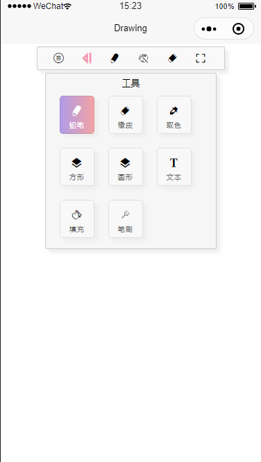
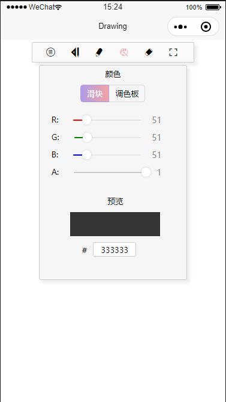

# Drawing-board
### 微信小程序实现画板
> 令人头秃= = 被微信小程序的canvas层级问题折磨了一整个上午orz

> 解决方案：参考网上的方法保存一个状态控制canvas的位置和假canvasx图片的显示和隐藏，不断通过canvas生成图片，然后重绘图片到canvas上

## 基础功能
1. 菜单：新建图；导入本地图；保存到本地
2. 工具：画笔；橡皮；吸色器；画矩形;加文字；
3. 画笔：修改画笔大小
4. 色盘：支持修改rgb和手动输入色值修改颜色；支持全局修改透明度
5. 橡皮：修改橡皮大小
6. 隐藏工具栏
## View
#### 启动页

#### 工具

#### 附上我的灵魂画作

